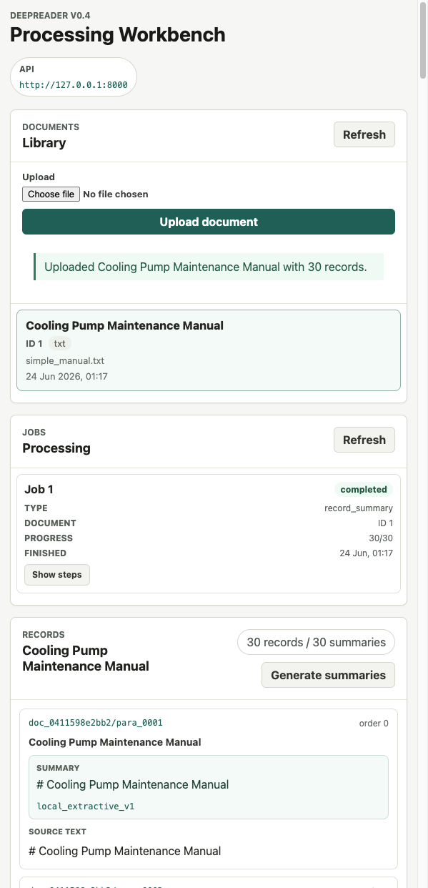
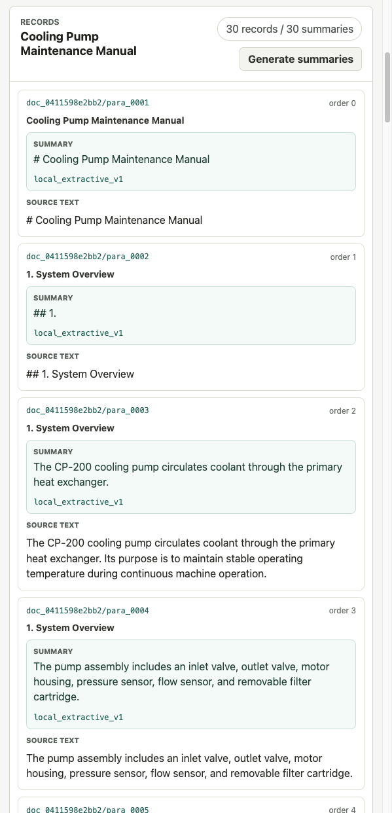
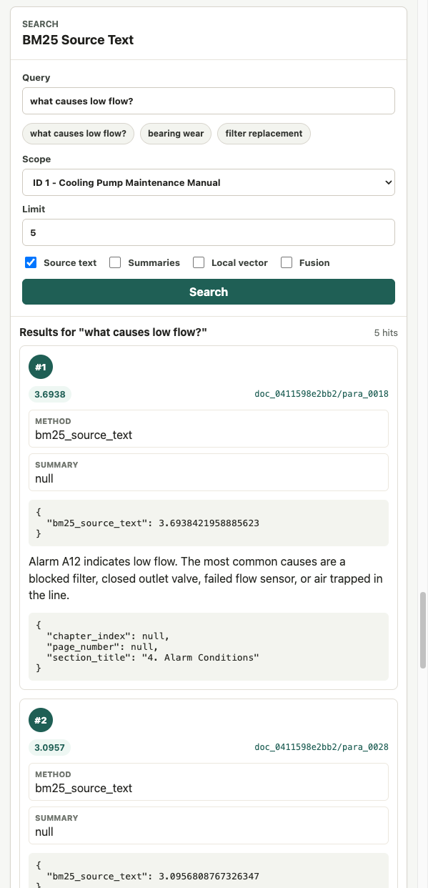
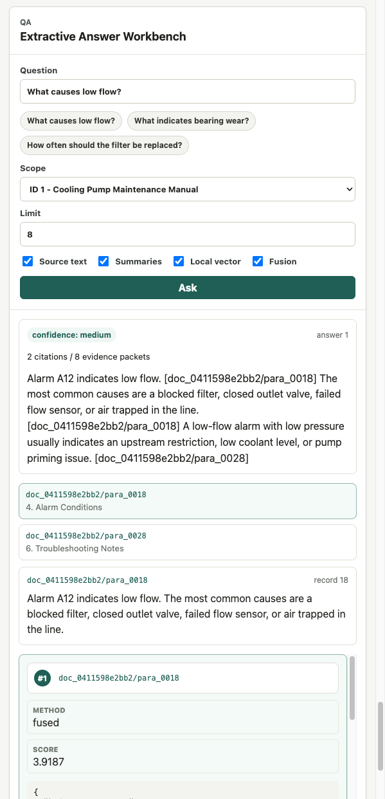
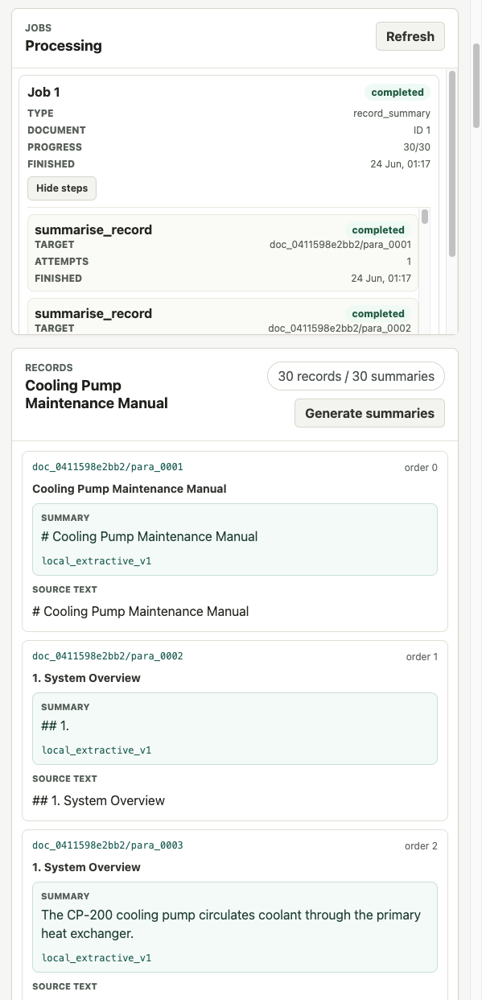

# DeepReader

DeepReader is a local-first AI document intelligence and RAG workbench for turning technical documents into inspectable retrieval evidence. It demonstrates the pieces a reviewer expects in a serious RAG system: document ingestion, deterministic record IDs, source-preserving retrieval, summaries, processing jobs, citations, and evidence inspection.

It is intentionally not a chatbot wrapper. The dashboard exposes records, scores, retrieval methods, summaries, job steps, citations, and evidence packets so the retrieval pipeline can be inspected end to end.

## Visual Walkthrough



*Document upload and records: ingest local `.txt` or `.epub` files, select documents, and inspect stable record IDs.*



*Generated summaries: deterministic local summaries are displayed beside preserved source text.*



*Search/retrieval results: compare ranked records with scores, retrieval methods, metadata, summaries, and source text.*



*Extractive QA with citations/evidence: answers remain tied to cited records and inspectable evidence packets.*



*Job tracking and steps: summary processing jobs expose status, progress, target stable IDs, attempts, and errors.*

## Core Features

- Text and EPUB ingestion through a FastAPI backend.
- SQLite persistence for local, reproducible demos.
- Deterministic document records with stable IDs and source hashes.
- Source-preserving BM25 retrieval over original document text.
- Local vector-style retrieval and simple fusion for comparison.
- Deterministic local summaries with checkpointing.
- Processing jobs and job steps for summary generation.
- Summary-aware search with visible retrieval methods and component scores.
- Deterministic extractive QA with citations, evidence packets, and retrieval settings.
- React/Vite/TypeScript dashboard built for inspection rather than chat.
- Docker Compose setup for a no-secrets local demo.
- Backend tests and frontend build in GitHub Actions CI.

No API keys are required. The local summariser and QA flow are deterministic placeholders for pipeline verification; they do not call OpenAI, Gemini, or any paid external API.

## Architecture

- `backend/src/deepreader/api`: FastAPI routes and response schemas.
- `backend/src/deepreader/ingest`: text and EPUB parsing.
- `backend/src/deepreader/storage`: SQLAlchemy models and repositories.
- `backend/src/deepreader/summarise`: local summariser, checkpointing, and summary job runner.
- `backend/src/deepreader/retrieval`: BM25, local vector-style retrieval, and fusion.
- `backend/src/deepreader/answer`: extractive QA, evidence packets, and citations.
- `frontend/src`: dashboard panels for uploads, documents, records, jobs, search, and QA.

More detail lives in [docs/ARCHITECTURE.md](docs/ARCHITECTURE.md).

## Local Quickstart

Install and run the backend:

```bash
cd backend
python3 -m venv .venv
source .venv/bin/activate
python3 -m pip install -e ".[dev]"
cd ..
make backend-dev
```

In a second terminal, install and run the frontend:

```bash
cd frontend
pnpm install --frozen-lockfile
pnpm dev
```

Open `http://127.0.0.1:5173`. The dashboard defaults to the backend at `http://127.0.0.1:8000`. To override it, copy `frontend/.env.example` to `frontend/.env` and set `VITE_API_BASE_URL`.

## Docker Quickstart

From the repository root:

```bash
docker compose up --build
```

Then open `http://127.0.0.1:5173`.

Docker Compose runs:

- backend on `http://127.0.0.1:8000`
- frontend on `http://127.0.0.1:5173`
- SQLite in a named local volume, mounted at `/app/data` in the backend container

No secrets or external services are required.

## Demo Workflow

Use [docs/DEMO_WORKFLOW.md](docs/DEMO_WORKFLOW.md) for a step-by-step reviewer script. The short version:

1. Start backend and frontend locally, or run Docker Compose.
2. Upload `examples/simple_manual.txt`.
3. Select the document and inspect records, stable IDs, and source text.
4. Search for `what causes low flow?`.
5. Generate summaries and inspect the processing job.
6. Search summaries.
7. Ask a QA question.
8. Inspect citations and evidence packets.
9. Run tests and the frontend build.

Reviewer checklist:

- Uploads accept `.txt` and `.epub` and reject unsafe filenames/extensions.
- Source records remain visible and unchanged.
- Stable IDs make records traceable across retrieval, summaries, citations, and jobs.
- Search results show scores, retrieval methods, metadata, summaries, and source text.
- QA answers expose citations and evidence rather than hidden generated claims.
- Tests and frontend build pass locally.

## Uploads

Dashboard uploads use the real API:

- `POST /documents/ingest/text` for `.txt`
- `POST /documents/ingest/epub` for `.epub`

The backend enforces local filename safety checks, extension allowlists, and upload size limits. Duplicate ingest currently creates another document row, while deterministic record stable IDs are reused for identical content. That behavior is intentional for now and tested.

## Jobs, Summaries, And Checkpointing

Generating summaries for a document creates a `record_summary` job and one `summarise_record` step per record. The job runner is synchronous today, but it stores background-style progress:

- `pending`
- `running`
- `completed`
- `failed`

Checkpointing is based on `record_id`, `summariser_name`, and `source_hash`. Rerunning summary generation skips unchanged records that already have a matching summary. If a record source hash changes, a new current summary is created and prior source text remains untouched.

The summariser is `local_extractive_v1`: it normalises whitespace, selects deterministic text, truncates predictably, and stores summary/source hashes. It is not meant to be high-quality AI prose.

## Search And QA

Search supports source text, summaries, local vector-style retrieval, and simple fusion. Response fields are inspection-first:

- `document_id`
- `record_id`
- `stable_id`
- `retrieval_method`
- `source_text`
- `summary`
- `metadata`
- `score`
- `component_scores`

The QA endpoint is deterministic and extractive. It returns an answer plus citations, all evidence packets, used evidence, unused evidence, and retrieval settings. It is not a chatbot and does not call an LLM.

## API Endpoints

- `POST /documents/ingest/text`
- `POST /documents/ingest/epub`
- `GET /documents`
- `GET /documents/{document_id}`
- `GET /documents/{document_id}/records`
- `POST /documents/{document_id}/summaries/run`
- `GET /documents/{document_id}/summaries`
- `GET /jobs`
- `GET /jobs/{job_id}`
- `GET /jobs/{job_id}/steps`
- `POST /jobs/{job_id}/retry-failed`
- `POST /search`
- `POST /qa/ask`
- `GET /answers`
- `GET /answers/{answer_id}`

## Makefile Commands

```bash
make test
make backend-dev
make frontend-dev
make frontend-build
```

`make frontend-dev` and `make frontend-build` use `pnpm` by default. Override with `NPM=npm` if needed.

## Verification

Backend:

```bash
make test
```

Frontend:

```bash
cd frontend
pnpm install --frozen-lockfile
pnpm build
```

Docker config:

```bash
docker compose config
```

GitHub Actions runs backend install/tests and frontend install/build without secrets.

## Configuration

Backend defaults live in `.env.example`:

- `DEEPREADER_DATABASE_URL=sqlite:///./data/deepreader.sqlite3`
- `DEEPREADER_MAX_UPLOAD_BYTES=10485760`
- `DEEPREADER_CORS_ORIGINS=http://127.0.0.1:5173,http://localhost:5173`

The default CORS origins are local-only. Uploaded file content and secrets are not logged by design. A small redaction utility exists for future provider-backed configuration, but no provider keys are needed today.

## Limitations

- SQLite is the only configured persistence layer.
- Text and EPUB are supported; real OCR and PDF OCR are not implemented.
- Summary jobs are synchronous despite job/step bookkeeping.
- The local summariser is deterministic and extractive, not an LLM summary.
- The local vector-style retriever is not embeddings and should not be treated as semantic search.
- Fusion is intentionally simple.
- QA is extractive and deterministic, not answer generation from a model.
- No auth, multi-user permissions, hosted deployment, PostgreSQL, Celery, Redis, or production observability stack.

## Roadmap

- Add a short demo video.
- Add optional provider-backed summaries behind disabled-by-default configuration.
- Add real embeddings and hybrid retrieval in a later milestone.
- Add richer job retry/checkpoint inspection.
- Add exportable evidence packets for reviewer handoff.
- Consider production deployment concerns only after the local portfolio workflow is stable.

## License

This project is licensed under the MIT License. See [LICENSE](LICENSE).
